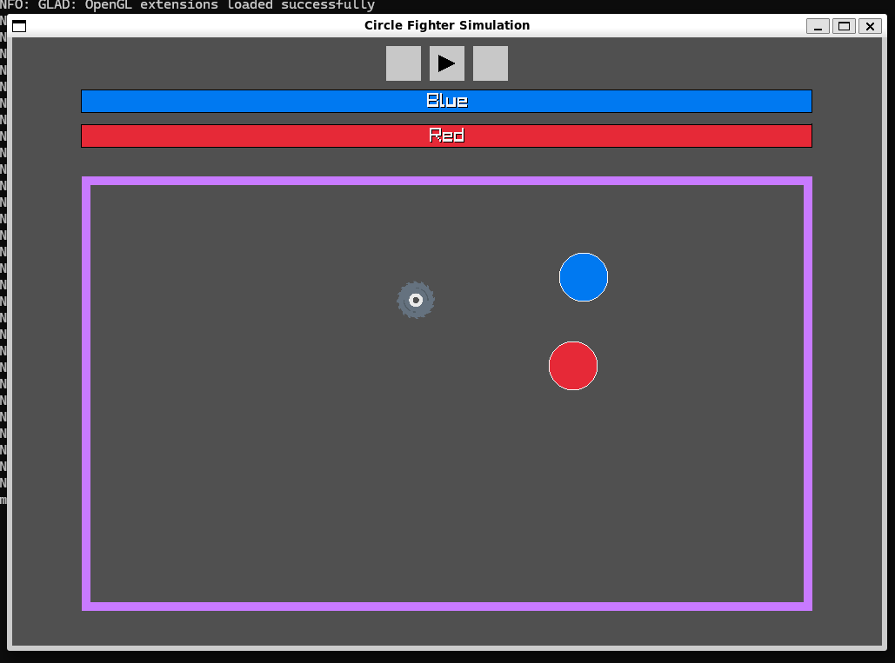
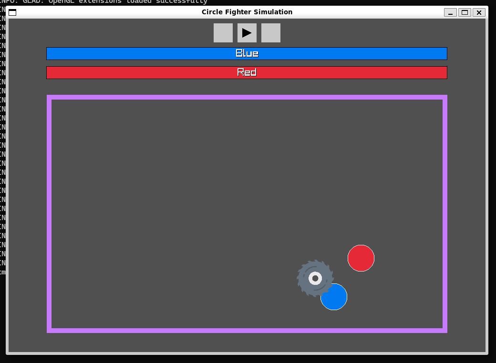
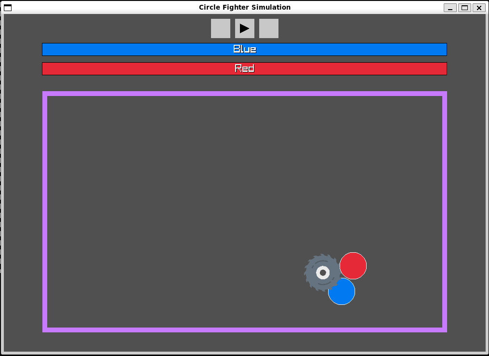
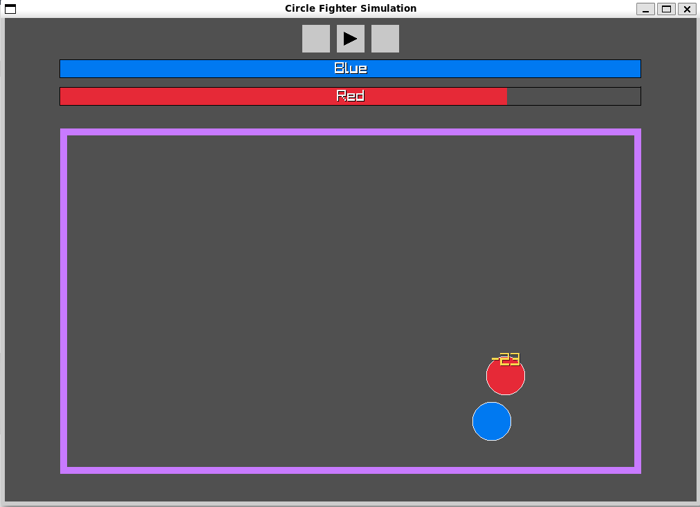
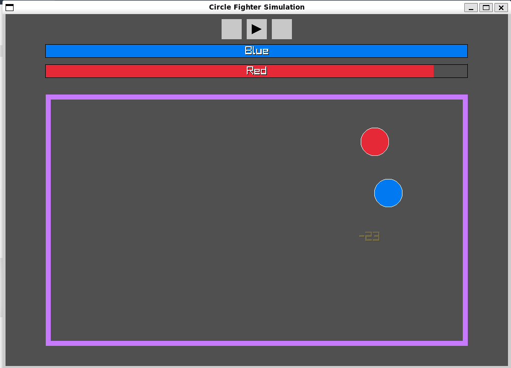

# CircleFight (Circle Fighter Simulation)

A small **2D circle-fighting simulation** written in **Java**, built to generate short, satisfying clips (e.g. for **Instagram Reels**).

Two circles (Red & Blue) spawn into an arena, take damage, pick up items, and “fight” via simple simulation rules — ideal for recording quick sequences.

---

## Demo / Screenshots

### Saw pickup → equipped → hit sequence
| Item spawned | Equipped | Close-up / in action | Hit (damage pop-up) |
|---|---|---|---|
|  |  |  |  |

### Heart pickup → heal
| Item spawned | Heal |
|---|---|
|  |  |

---

## What it does

- **2D arena simulation** with boundary walls
- **Two fighters** (Blue vs Red) with **health bars**
- **Damage/heal feedback** (e.g., floating numbers)
- **Item system** (currently showcased in README):
  - **Saw**: offensive item that enables damage
  - **Heart**: restores health

---

## Quick start

### Prerequisites
- **Java JDK** installed (a recent JDK is recommended)
- A machine capable of running **OpenGL** (this is a windowed simulation)

### Run
This repo includes a convenience script:

```bash

